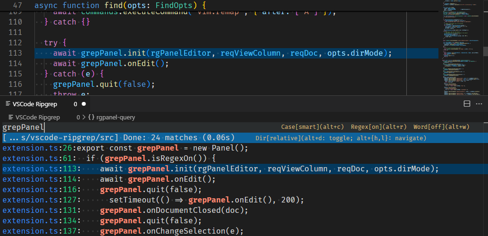

# VSCode RipGrep

This extension provides a full keyboard navigable, swiper-inspired ripgrep UI in VSCode.



## Quick Start

You need to install ripgrep and optionally point the configuration
`ripgrep.ripgrep.exe` to the binary, if it's not accessible from PATH.

The entrypoint is commad "Ripgrep: find".

By default, it

- uses your text selection as the query if available; and
- starts a ripgrep search session under the current directory according to the current file opened, or fallback to project directory.

You can also bind a key to it like this

```json
{ "key": "alt+f", "command": "ripgrep.find" },
```

## Shortcuts

### Search Result Navigation

When some search results are generated, you can use `ctrl+j` or `ctrl+k` to
navigate through the results (mouse click also works!).

We also open up the file for you to preview the lines around the match.

When you are happy with the result, press `enter` to stay on the file; otherwise
`escape` brings you back to where you started the search session.

### Search Mode Change

You can change some search modes on the fly.

For search directory, you can use

- `alt+d` (dir) to switch between current dir and workspace dir
- `alt+h` (left) to change the directory to the parent
- `alt+l` (right) to undo last `alt+h`

For ripgrep search options, you can use

- `alt+c` (case) to toggle case match mode ("smart", "ignore" or "strict")
  ("smart" means "ignore" if all lower-case, and "strict" otherwise)
- `alt+r` (regex) to toggle regex mode
- `alt+w` (word) to toggle word match mode

## Advanced

You can specify optional arguments to the `ripgrep.find` to control some default
behaviors on the init directory and init query text:

```typescript
{ dirMode?: "doc" | "workspace"; withSelection?: boolean; }
```
